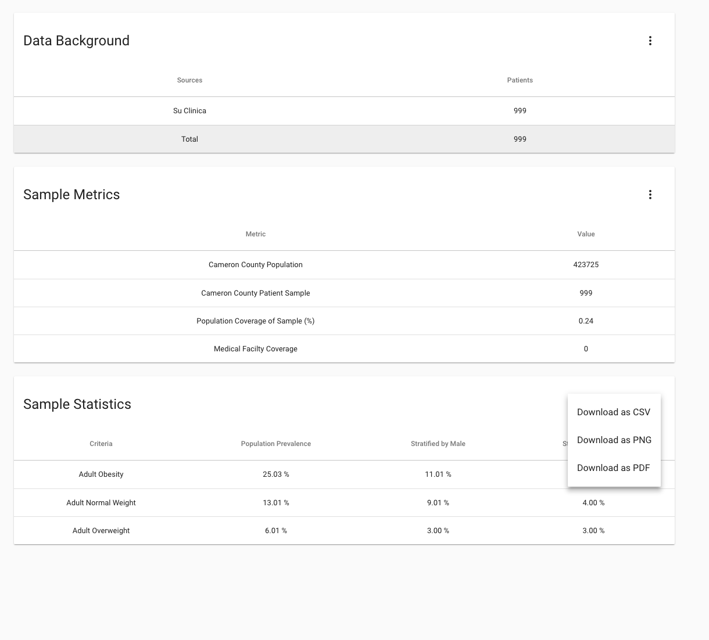
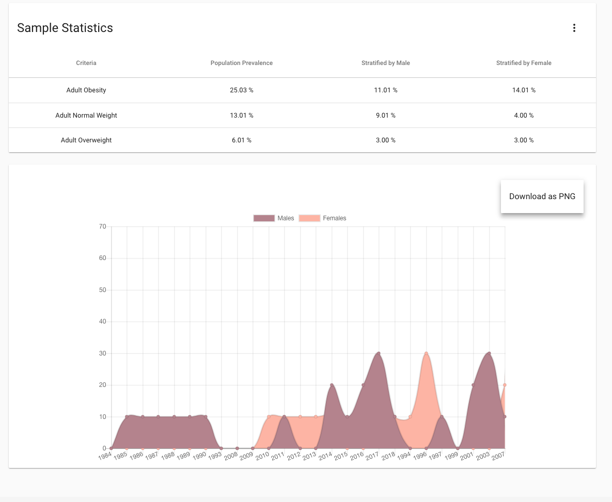

# Application Manual
## CS6440 Fall 2018 – FHIR Buffer Overflow
### Utilizing FHIR Bulk Data API for Real-Time Public Health Needs Assessments

#### Project 34
#### Team Name: FHIR Buffer Overflow
#### TA Mentor: Taylor Startin
#### External Mentors: Johnny Bender
#### [Github Repository Link:] https://github.gatech.edu/gt-cs6440-hit-fall2018/Utilizing-FHIR-Bulk-Data-API-for-Real-Time-Public-Health-Needs-Assessments

|Team Members | GT Username | Email |
| ------------| ----------- | ----- |
| Varun Behl  |   vbehl3    | vbehl@gatech.edu|
| Pauline Sho |   psho3     | psho3@gatech.edu |
| Chulmin “Simon” Lee | clee702 | clee702@gatech.edu |
| Cody Hutchens | chutchens3 | chutchens3@gatech.edu |
| Van Mang | vmang3 | vmang3@gatech.edu |
| Vijay Pothona | vpothana3 | vpothana3@gatech.edu |

## For a complete step by step instructions please refer to special instruction below
[Special Instrcutions](https://github.gatech.edu/gt-cs6440-hit-fall2018/Utilizing-FHIR-Bulk-Data-API-for-Real-Time-Public-Health-Needs-Assessments/blob/master/Final%20Delivery/Special%20Instructions%20-%20FHIR%20Buffer%20Overflow.md)
## Overview of the Project
The overal project was for us to use a newly specified the new FHIR Bulk Data API and use that health data from the bulk export to generate Health Needs Assessments.

### Application purpose
The application will be used by public health agencies and healthcare organizations to focus on implementing the solutions to address the identified needs

## Functionality
- Curation Aspect
- Frontend UI
- FHIR Server API
- Authentication 

## Design
Data Background provides us details on the data sources and how many patients information we have for each source.
We are currently using 10 sources in production
Sample statistics provides the prevalence satisfied by sex and age groups of the conditions

### A graphical representation that provides us information about incidence calculation of obesity  

 

