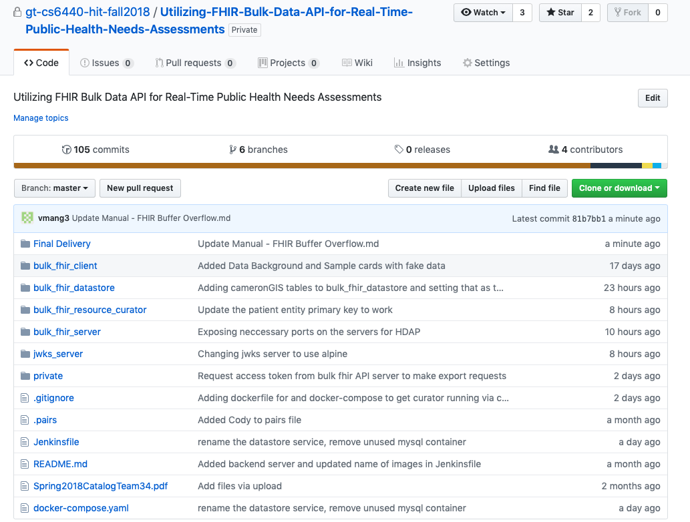

# Application Manual
## CS6440 Fall 2018 – FHIR Buffer Overflow
### Utilizing FHIR Bulk Data API for Real-Time Public Health Needs Assessments

#### Project 34
#### Team Name: FHIR Buffer Overflow
#### TA Mentor: Taylor Startin
#### External Mentors: Johnny Bender
#### [Github Repository Link:] https://github.gatech.edu/gt-cs6440-hit-fall2018/Utilizing-FHIR-Bulk-Data-API-for-Real-Time-Public-Health-Needs-Assessments

|Team Members | GT Username | Email |
| ------------| ----------- | ----- |
| Varun Behl  | vbehl3      | vbehl@gatech.edu|
| Pauline Sho | psho3       | psho3@gatech.edu |
| Chulmin “Simon” Lee | clee702 | clee702@gatech.edu |
| Cody Hutchens | chutchens3 | chutchens3@gatech.edu |
| Van Mang | vmang3 | vmang3@gatech.edu |
| Vijay Pothona | vpothana3 | vpothana3@gatech.edu |

#### Application Purpose:

### How to run the code? 
##### Step 1: Clone the repository 
##### Step 2: cd server
##### Step 3: ./mvnw package 
##### Step 4: cd curator 
##### Step 5: ./gradlew build
##### Step 6: cd project root
##### Step 7: docker-compose up -d --build
 

