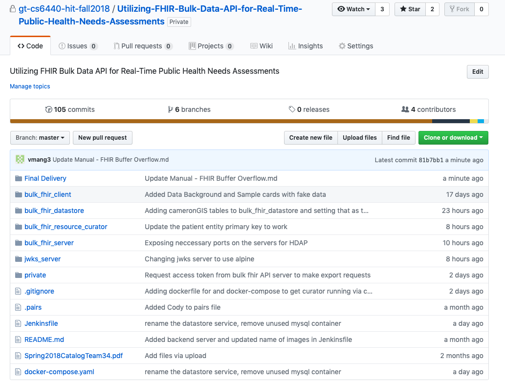

# Special Instructions
## CS6440 Fall 2018 – FHIR Buffer Overflow
### Utilizing FHIR Bulk Data API for Real-Time Public Health Needs Assessments

#### Project 34
#### Team Name: FHIR Buffer Overflow
#### TA Mentor: Taylor Startin
#### External Mentors: Johnny Bender
#### [Github Repository Link:] https://github.gatech.edu/gt-cs6440-hit-fall2018/Utilizing-FHIR-Bulk-Data-API-for-Real-Time-Public-Health-Needs-Assessments

|Team Members | GT Username | Email |
| ------------| ----------- | ----- |
| Varun Behl  | vbehl3      | vbehl@gatech.edu|
| Pauline Sho | psho3       | psho3@gatech.edu |
| Chulmin “Simon” Lee | clee702 | clee702@gatech.edu |
| Cody Hutchens | chutchens3 | chutchens3@gatech.edu |
| Van Mang | vmang3 | vmang3@gatech.edu |
| Vijay Pothona | vpothana3 | vpothana3@gatech.edu |

#### Technical Requirements
##### Install docker
On MacOS,
`brew cask install docker`
##### Install docker-compose

#### How to run the Application
##### Step 1: Run docker
On MacOS, click on the Docker app with the whale icon.
##### Step 2: Clone the repository 
`git clone https://github.gatech.edu/gt-cs6440-hit-fall2018/Utilizing-FHIR-Bulk-Data-API-for-Real-Time-Public-Health-Needs-Assessments.git`
##### Step 3: Change into the server directory
`cd bulk_fhir_server`
##### Step 4: Run mvnw
`./mvnw package`
##### Step 5: Change into the curator directory
`cd ../bulk_fhir_resource_curator/`
##### Step 6: Build gradle
`./gradlew build`
##### Step 7: Go back to root directory
`cd ..`
##### Step 8: Start/build docker
`docker-compose up -d --build`
##### Step 9: View results
Launch https://cs6440-f18-prj20.apps.hdap.gatech.edu/ on your browser.

(Note: Since we use docker for everything (including the database), every time we push, it rebuilds the data. It takes around 2 hours or so to get the curator to get all the source systems data normalized.)
